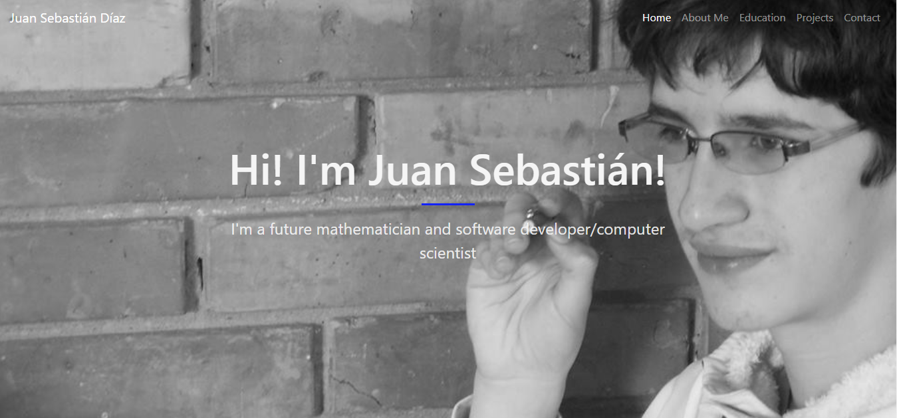

# Juan Sebastián Díaz Personal Webpage

## About

This is my personal webpage which shows part of my academic career so far, which shows
* About me, including current interests
* Education
* Projects
* Contact

This project was made for the [Web Development](http://johnguerra.co/classes/webDevelopment_fall_2018/) course here at the [Universidad de los Andes](https://uniandes.edu.co/en).

This can be run using any http server, including http-server for Node.js

## Technologies

I used HTML, CSS, Javascript, Bootstrap, Jquery and Jquery easing.

## Authors

Made by [Juan Sebastián Díaz](https://github.com/js-diaz)

You can find the webpage online [here](https://js-diaz.github.io/)

## License

MIT License

Copyright (c) 2018 Juan Sebastián Díaz

Permission is hereby granted, free of charge, to any person obtaining a copy
of this software and associated documentation files (the "Software"), to deal
in the Software without restriction, including without limitation the rights
to use, copy, modify, merge, publish, distribute, sublicense, and/or sell
copies of the Software, and to permit persons to whom the Software is
furnished to do so, subject to the following conditions:

The above copyright notice and this permission notice shall be included in all
copies or substantial portions of the Software.

THE SOFTWARE IS PROVIDED "AS IS", WITHOUT WARRANTY OF ANY KIND, EXPRESS OR
IMPLIED, INCLUDING BUT NOT LIMITED TO THE WARRANTIES OF MERCHANTABILITY,
FITNESS FOR A PARTICULAR PURPOSE AND NONINFRINGEMENT. IN NO EVENT SHALL THE
AUTHORS OR COPYRIGHT HOLDERS BE LIABLE FOR ANY CLAIM, DAMAGES OR OTHER
LIABILITY, WHETHER IN AN ACTION OF CONTRACT, TORT OR OTHERWISE, ARISING FROM,
OUT OF OR IN CONNECTION WITH THE SOFTWARE OR THE USE OR OTHER DEALINGS IN THE
SOFTWARE.
